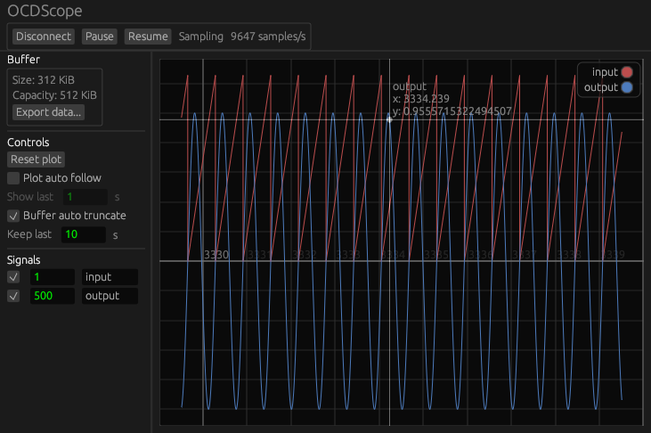

# OCDScope

_An high performance digital scope for embedded devices, on top of [OpenOCD](https://openocd.org/)._



This program allows to plot the value of variables of interest in a firmware running on an embedded device to which OpenOCD can connect.

Relatively high sample rates can be achieved, especially with the [RTT](https://wiki.segger.com/RTT) sampler.
For instance, an STM32F4 clocked at 168MHz with the STLink probe embedded into the development board (ST Nucleo) can continuously plot 4 signals at a sampling rate of 20kHz or above.
A lower performance STM32F072RB clocked at 48MHz can continuously plot 2 signals at 10kHz with RTT, and 1 signal at 2kHz by memory sampling.

The project is inspired by [SEGGER's JScope](https://www.segger.com/products/debug-probes/j-link/tools/j-scope/), but works cross-platform and with [all probes supported by OpenOCD](https://openocd.org/doc-release/html/Debug-Adapter-Hardware.html#Debug-Adapter-Hardware).

It is currently just an MVP, and its state and code quality can be described as "very work in progress". Nevertheless, it has already proven useful during "work in the field" for debugging, high frequency signals inspection, control loop tuning, etc.

The program is currently not very robust, especially in the Telnet communication, so expect flaky behavior.

The project is written in Rust and is currently using the [egui](https://github.com/emilk/egui) crate for its GUI.


## Setup

### Obtain a development build

Grab the latest development build from the artifacts of the last workflow run from [this page](https://github.com/gdelazzari/OCDScope/actions/workflows/provide-dev-builds.yml). Development builds are currently provided for Linux and Windows.

### Obtain a suitable version of OpenOCD

This project has only been tested with OpenOCD v0.12.0, and is quite tied to the specific output that OpenOCD provides through its Telnet interface. For instance, the xPack Windows builds don't work due to them providing slightly different answers to Telnet commands.

On Linux, this has been tested with the Arch Linux `openocd` package but should likely work with other distros official packages.

On Windows, or if your Linux distro doesn't provide a suitable package, a compatible build can be obtained from the automatic [artifacts of the GitHub mirror releases](https://github.com/openocd-org/openocd/releases/tag/v0.12.0).

Finally, if you're using a development environment (like an Eclipse-based vendor IDE, or Visual Studio Code with the Cortex-Debug extension) you likely already have OpenOCD somewhere in your system, and you may try to use that. Moreover you could try to directly attach to the running OpenOCD server that the development environment spawns, which would allow to plot RTT signals even while the debug session is active.


## Usage

1. Ensure an OpenOCD server is running and take note of the Telnet and GDB ports that it's listening to.

    For instance, to connect with an STLink to an STM32F4 target, you may start OpenOCD as follows:

    ```console
    $ openocd -f interface/stlink.cfg -f target/stm32f4x.cfg
    ```

    Please refer to the official [OpenOCD documentation](https://openocd.org/doc-release/html/index.html) (specifically the _Running_ section) for help in this regard.

    By default, OpenOCD will listen for Telnet connections on `localhost:4444` and GDB connections on `localhost:3333`. If OpenOCD has been started by an IDE, the ports might differ, and you need to obtain their number.

2. Launch OCDScope.
3. Click on the _Connect_ button on the top left corner.
4. Choose between RTT or memory sampling.
    - If sampling over RTT:
        1. Ensure the address and port for the Telnet interface are correct.
        2. Choose a suitable polling interval (if unsure, set to the minimum of `1` milliseconds).
        3. Ensure the target is configuring an RTT up buffer with a name adhering to the [SEGGER JScope convention](https://wiki.segger.com/UM08028_J-Scope#RTT_channel_naming_convention).
        For instance, a channel named `JScope_T4F4F4` is parsed as providing a 32-bit timestamp together with two 32-bit floating point values.
    - With memory sampling:
        1. Ensure the address and port for the GDB interface are correct.
        2. Choose a feasible sampling frequency. This depends on your MCU, probe and in general your hardware setup, and some experimentation might be required to find a stable value that can be achieved. Also take note that all specified variables will be sampled at this rate, so if you known that your hardware handles a maximum of 1000Hz of memory sampling rate _with one variable_, it will sample _at most_ at 500Hz with two variables.
        3. Optionally load the ELF file of the firmware that is running on the microcontroller. The program will find all the 32-bit global symbols and suggest them as signals to be sampled in the main interface. If this step is skipped, or is not successful, variables to be sampled can be manually added through their memory address in the sidebar.
5. Click on _Connect_ to start the sampling process.
6. Enable signals to be sampled with their corresponding checkbox in the signal list of the sidebar.

Some notes about the current behavior of the interface, in this initial MVP state:

- The plot starts in "automatic" mode, which keeps all of the signal visible. If panning or zooming happens, this state is lost, but can be recovered at any moment by clicking on the _Reset plot_ button.
- The green numbers between the enable checkbox and the signal name allow to enter a custom multiplier for the signal value, so that the curve on the plot scales accordingly. The values displayed when hovering the samples, however, will still be the original (unscaled) ones.

In general, the interface is currently very minimal and unoptimized (from an UX perspective), so don't expect anything fancy. Suggestions are very welcome!


## Main TODOs / roadmap

- [ ] Improved buffer data structure and custom plotting for handling bigger amounts of samples with very high performance.
- [ ] Make Telnet communication more robust (possibly consider the TCL interface instead).
- [ ] Make the export feature more robust.
- [ ] Automatically detect a running OpenOCD server and its listening ports.
- [ ] Improve the memory sampler, try to make it more precise and robust in case it starts to lag behind.
- [ ] Add a memory sampler mode that splits the maximum sampling frequency between multiple signals (or make it do this by default).
- [ ] Make the memory sampler automatically discover the maximum sampling frequency.
- [ ] Mean and variance estimation of a signal in a given interval.
- [ ] Expose more settings to the user.
- [ ] Better UX and plot controls/interaction.
- [ ] Persist "project" settings (signal names and multipliers, plot configuration, ...):
    - with memory sampling, we can save a custom file alongside the loaded ELF executable;
    - with RTT sampling we might try to obtain an unique identifier from the target model, RTT buffer name, ... and store settings with such identifier.
- [ ] Various quality of life and stability improvements that are mainly noted in the codebase with _TODO_ and _FIXME_ comments.
- [ ] Add other samplers, beyond OpenOCD, if anyone is interested. Some examples:
    - UART, TCP/IP or SocketCAN (possibly with custom parsers).
    - Audio (microphone/line input).


## Notes about the development

### Code and commits style conventions

The standard `rustfmt` settings are used, and the code is automatically formatted with it as to achieve a consistent style.

The commit messages follow the [Conventional Commits](https://www.conventionalcommits.org/en/v1.0.0/) specification.

### Logging

Set the environment variable `RUST_LOG=debug` or `RUST_LOG=trace` for more verbose output, if needed.

### Current CI setup

- `main` branch is intended to hold the latest development build which should be sort-of-usable
- `devel` branch is intended for development work, with CI checks
- `feat/*`, `fix/*`, ... branches are used for quiet development of features, fixes, etc without CI intervention

Currently, development builds for Linux and Windows are produced and stored when a commit on `main` happens. Those require some time, so we avoid building them at every `devel` commit and only trigger on `main` push.

The "Build and test" workflow instead runs when pushing or making a pull request both on `main` and `devel`, and checks that the code builds and the unit tests pass.


## License

OCDScope is licensed under the MIT License (MIT).

Copyright © 2023 - Giacomo De Lazzari

Permission is hereby granted, free of charge, to any person obtaining a copy of this software and associated documentation files (the “Software”), to deal in the Software without restriction, including without limitation the rights to use, copy, modify, merge, publish, distribute, sublicense, and/or sell copies of the Software, and to permit persons to whom the Software is furnished to do so, subject to the following conditions:

The above copyright notice and this permission notice shall be included in all copies or substantial portions of the Software.

THE SOFTWARE IS PROVIDED “AS IS”, WITHOUT WARRANTY OF ANY KIND, EXPRESS OR IMPLIED, INCLUDING BUT NOT LIMITED TO THE WARRANTIES OF MERCHANTABILITY, FITNESS FOR A PARTICULAR PURPOSE AND NONINFRINGEMENT. IN NO EVENT SHALL THE AUTHORS OR COPYRIGHT HOLDERS BE LIABLE FOR ANY CLAIM, DAMAGES OR OTHER LIABILITY, WHETHER IN AN ACTION OF CONTRACT, TORT OR OTHERWISE, ARISING FROM, OUT OF OR IN CONNECTION WITH THE SOFTWARE OR THE USE OR OTHER DEALINGS IN THE SOFTWARE.
